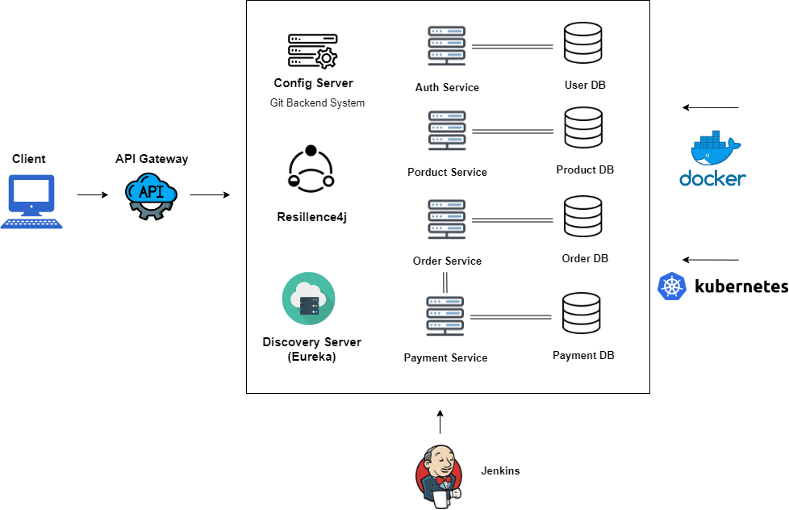
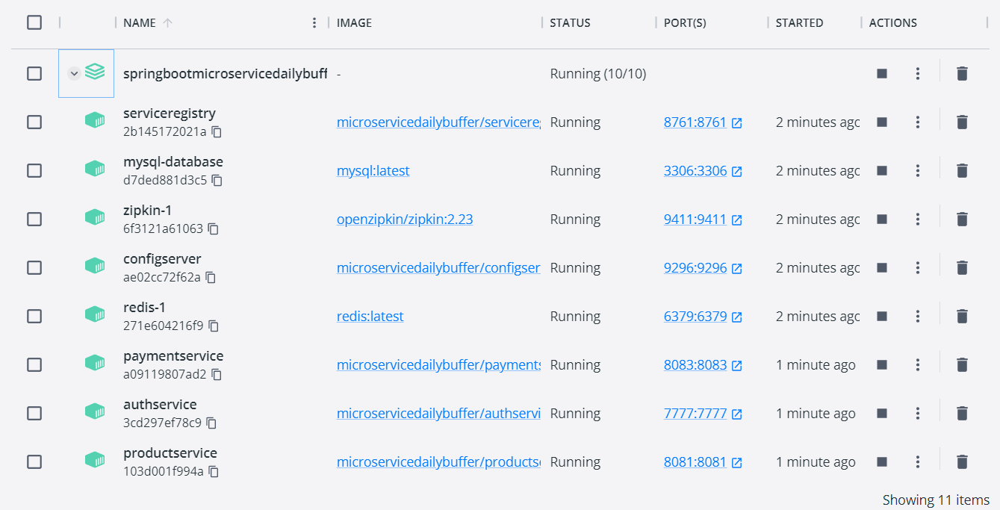
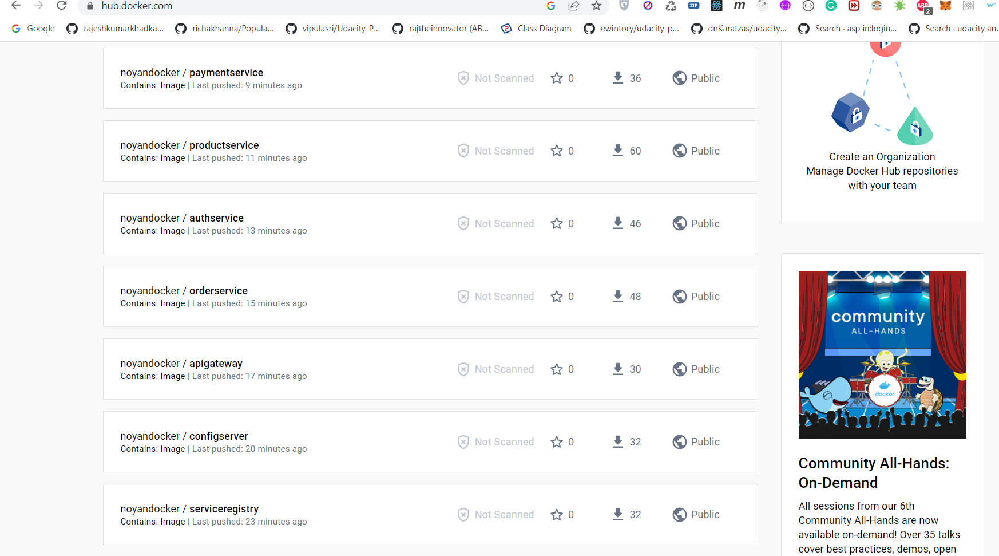
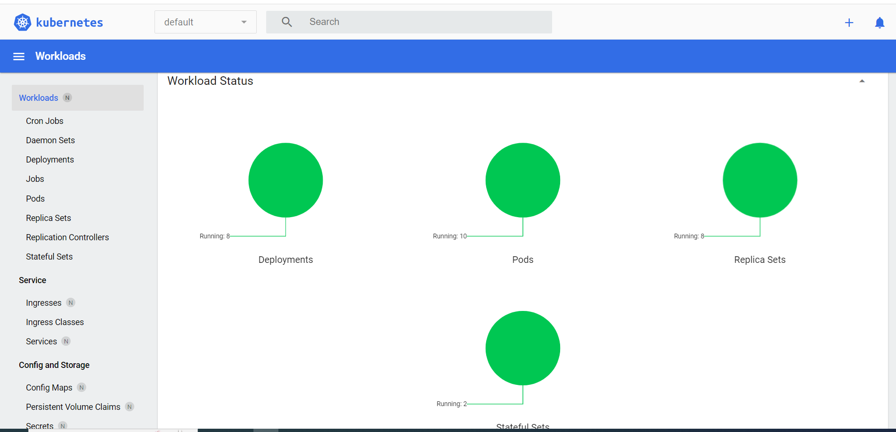
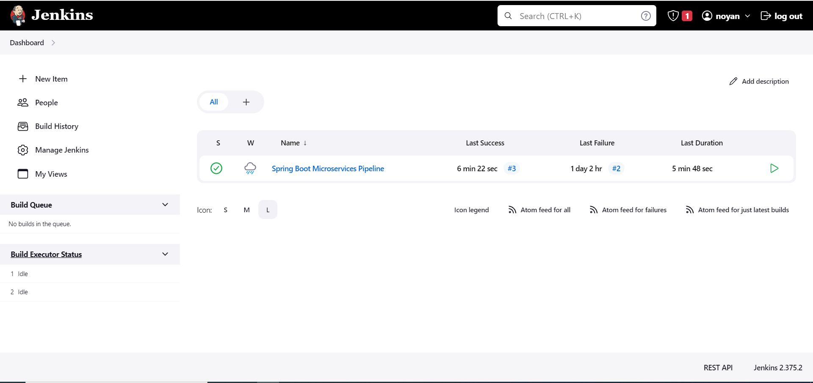
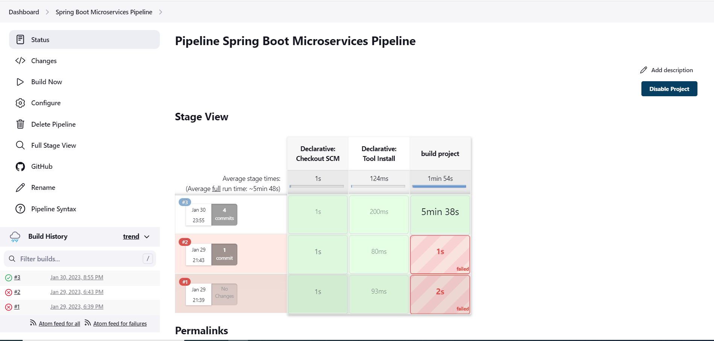

# Spring Boot Microservice Example (Eureka Server, Config Server, API Gateway, Services , Zipkin, Redis, Resilience4j, Docker, Kubernetes)



# About the project
<ul style="list-style-type:disc">
  <li>This project is based Spring Boot Microservices with the usage of Docker and Kubernetes</li>
  <li>User can register and login through auth service by user role (ADMIN or USER) through api gateway</li>
  <li>User can send any request to relevant service through api gateway with its bearer token</li>
</ul>

7 services whose name are shown below have been devised within the scope of this project.

- Config Server
- Eureka Server
- API Gateway
- Auth Service
- Order Service
- Payment Service
- Product Service

### Docker Hub
<a href="https://hub.docker.com/search?q=noyandocker">Link</a>

### Git Backend for Config server
<a href="https://github.com/Rapter1990/springappconfig">Link</a>

### Explore Rest APIs

<table style="width:100%">
  <tr>
      <th>Method</th>
      <th>Url</th>
      <th>Description</th>
      <th>Valid Request Body</th>
      <th>Valid Request Params</th>
      <th>Valid Request Params and Body</th>
  </tr>
  <tr>
      <td>POST</td>
      <td>authenticate/signup</td>
      <td>Signup for User and Admin</td>
      <td><a href="README.md#signup">Info</a></td>
      <td></td>
      <td></td>
  </tr>
  <tr>
      <td>POST</td>
      <td>authenticate/login</td>
      <td>Login for User and Admin</td>
      <td><a href="README.md#login">Info</a></td>
      <td></td>
      <td></td>
  </tr>
  <tr>
      <td>POST</td>
      <td>authenticate/refreshtoken</td>
      <td>Refresh Token for User and Admin</td>
      <td><a href="README.md#refreshtoken">Info</a></td>
      <td></td>
      <td></td>
  </tr>
  <tr>
      <td>POST</td>
      <td>/product</td>
      <td>Add Product</td>
      <td><a href="README.md#addproduct">Info</a></td>
      <td></td>
      <td></td>
  </tr>
  <tr>
      <td>GET</td>
      <td>/product/{product_id}</td>
      <td>Get Product By Id</td>
      <td></td>
      <td></td>
      <td><a href="README.md#getProductById">Info</a></td>
  </tr>
  <tr>
      <td>PUT</td>
      <td>/reduceQuantity/{product_id}?quantity={quantity_value}</td>
      <td>Reduce Quantity of Product</td>
      <td></td>
      <td><a href="README.md#reduceQuantityOfProduct">Info</a></td>
      <td></td>
  </tr>
  <tr>
      <td>DELETE</td>
      <td>/product/{product_id}</td>
      <td>Delete Prodcut By Id</td>
      <td></td>
      <td></td>
      <td><a href="README.md#deleteProductById">Info</a></td>
  </tr>
  <tr>
      <td>POST</td>
      <td>/order/placeorder</td>
      <td>Place Order</td>
      <td><a href="README.md#placeOrder">Info</a></td>
      <td></td>
      <td></td>
  </tr>
  <tr>
      <td>GET</td>
      <td>/order/{order_id}</td>
      <td>Get Order By Id</td>
      <td></td>
      <td></td>
      <td><a href="README.md#getOrderById">Info</a></td>
  </tr>
  <tr>
      <td>GET</td>
      <td>/payment/order/{order_id}</td>
      <td>Get Payment Details by Order Id</td>
      <td></td>
      <td></td>
      <td><a href="README.md#getPaymentDetailsByOrderId">Info</a></td>
  </tr>

</table>

### Used Dependencies
* Core
    * Spring
        * Spring Boot
        * Spring Boot Test (Junit)
        * Spring Security
        * Spring Web
            * RestTemplate
            * FeighClient
        * Spring Data
            * Spring Data JPA
        * Spring Cloud
            * Spring Cloud Gateway Server
            * Spring Cloud Config Server
            * Spring Cloud Config Client
    * Netflix
        * Eureka Server
        * Eureka Client
* Database
    * Mysql
* Redis
* Zipkin
* Docker
* Kubernetes
* Jenkins
* Junit
* Log4j2

## Valid Request Body

##### <a id="signup"> Signup for User and Admin
```
    http://localhost:9090/authenticate/signup
    
    {
        "username" : "User",
        "password" : "User",
        "email" : "user@refreshtoken.com",
        "roles" : [
                "ROLE_USER"
        ]
    }
    
    http://localhost:9090/authenticate/signup
    
    {
        "username" : "admin1",
        "password" : "admin1",
        "email" : "admin1@refreshtoken.com",
        "roles" : [
                "ROLE_ADMIN"
        ]
    }
```

##### <a id="login"> Login for User and Admin
```
    http://localhost:9090/authenticate/login
    
    {
        "username" : "User",
        "password" : "User"
    }
    
    http://localhost:9090/authenticate/login
    
    {
        "username" : "UserAdmin",
        "password" : "UserAdmin"
    }
```

##### <a id="refreshtoken"> Refresh Token for User and Admin
```
    http://localhost:9090/authenticate/refreshtoken
    
    {
        "refreshToken" : ""
    }
```

##### <a id="addProduct"> Add Product
```
    http://localhost:9090/product
    
    {
        "name" : "Product 1",
        "price" : 100,
        "quantity" : 1
    }
    
    Bearer Token : User Token
```

##### <a id="placeorder"> Place Order
```
    http://localhost:9090/order/placeorder
    
    {
        "productId" : 1,
        "totalAmount" : 100,
        "quantity" : 1,
        "paymentMode" : "CASH"
    }
    
    Bearer Token : User Token
```

## Valid Request Params

##### <a id="reduceQuantityOfProduct">Reduce Quantity of Product
```
    http://localhost:9090/product/reduceQuantity/1?quantity=1
    
    Bearer Token : User Token
```

## Valid Request Params and Body

##### <a id="getProductById">Get Product By Id
```
    http://localhost:9090/product/{prodcutId}
    
    Bearer Token : User Token
```

##### <a id="deleteProductById">Delete Product By Id
```
    http://localhost:9090/product/{prodcutId}
    
    Bearer Token : Admin Token
```

##### <a id="deleteProductById">Delete Product By Id
```
    http://localhost:9090/order/{order_id}
    
    Bearer Token : User Token
```

##### <a id="getPaymentDetailsByOrderId">Get Payment Details by Order Id
```
    http://localhost:9090/payment/order/{order_id}
    
    Bearer Token : User Token
```

### 🔨 Run the App

<b>Local</b>

<b>1 )</b> Download your project from this link `https://github.com/Rapter1990/springbootmicroservicedailybuffer`

<b>2 )</b> Go to the project's home directory :  `cd springbootmicroservicedailybuffer`

<b>3 )</b> Run <b>Service Registry (Eureka Server)</b>

<b>4 )</b> Run <b>config server</b>

<b>5 )</b> Run <b>zipkin</b> and <b>redis</b> through these commands shown below on <b>Docker</b>
```
    docker run -d -p 9411:9411 openzipkin/zipkin
    docker run -d --name redis -p 6379:6379 redis
```

<b>6 )</b> Run <b>api gateway</b>

<b>7 )</b> Run other services (<b>auth-service</b>, <b>orderservice</b>, <b>paymentservice</b> and lastly <b>productservice</b>)

<b>Docker</b>

<b>1 )</b> Install <b>Docker Desktop</b>. Here is the installation <b>link</b> : https://docs.docker.com/docker-for-windows/install/

<b>2 )</b> Build <b>jar</b> file for all services shown below

<table style="width:100%">
  <tr>
    <th>Service</th>
    <th>Command</th>
  </tr>
  <tr>
    <td>service-registry</td>
    <td>mvn clean install</td>
  </tr>
  <tr>
    <td>configserver</td>
    <td>mvn clean install</td>
  </tr>
  <tr>
    <td>apigateway</td>
    <td>mvn clean install -DskipTests</td>
  </tr>
  <tr>
    <td>auth-service</td>
    <td>mvn clean install -DskipTests</td>
  </tr>
  <tr>
    <td>orderservice</td>
    <td>mvn clean install -DskipTests</td>
  </tr>
  <tr>
    <td>productservice</td>
    <td>mvn clean install -DskipTests</td>
  </tr>
  <tr>
    <td>paymentservice</td>
    <td>mvn clean install -DskipTests</td>
  </tr>
</table>

<b>3 )</b> Build all <b>images</b> and push to <b>Docker Hub</b>
```
    1 ) service-registry
     
        - docker build -t microservicedailybuffer/serviceregistry:0.0.1 .
        - docker tag microservicedailybuffer/serviceregistry:0.0.1 noyandocker/serviceregistry
        - docker push noyandocker/serviceregistry
        
    2 ) configserver
     
        - docker build -t microservicedailybuffer/configserver:0.0.1 .
        - docker tag microservicedailybuffer/configserver:0.0.1 noyandocker/configserver
        - docker push noyandocker/configserver
    
    3 ) api-gateway
     
        - docker build -t microservicedailybuffer/apigateway:0.0.1 .
        - docker tag microservicedailybuffer/apigateway:0.0.1 noyandocker/apigateway
        - docker push noyandocker/apigateway
    
    4 ) auth-service
     
        - docker build -t microservicedailybuffer/authservice:0.0.1 
        - docker tag microservicedailybuffer/authservice:0.0.1 noyandocker/authservice
        - docker push noyandocker/authservice
        
    5 ) productservice
     
        - docker build -t microservicedailybuffer/productservice:0.0.1 .
        - docker tag microservicedailybuffer/productservice:0.0.1 noyandocker/productservice
        - docker push noyandocker/productservice
        
    6 ) orderservice
     
        - docker build -t microservicedailybuffer/orderservice:0.0.1 .
        - docker tag microservicedailybuffer/orderservice:0.0.1 noyandocker/orderservice
        - docker push noyandocker/orderservice
        
    7 ) paymentservice
     
        - docker build -t microservicedailybuffer/paymentservice:0.0.1 .
        - docker tag microservicedailybuffer/paymentservice:0.0.1 noyandocker/paymentservice
        - docker push noyandocker/paymentservice
```

<b>4 )</b> Run all <b>Containers</b> through this command shown below under main folder
```
    docker-compose up -d
```
<b>5 )</b> Send request to any service by using request collections under <b>postman_collection</b> 

<b>Kubernetes</b>

<b>1 )</b> Install <b>minikube</b> to access this link https://minikube.sigs.k8s.io/docs/start/

<b>2 )</b> Open <b>command prompt</b> and install <b>kubectl</b> through this command shown below 
```
    minikube kubectl --
```

<b>3 )</b> Start <b>minikube</b> through this command shown below.
```
    minikube start
```

<b>4 )</b> Open <b>minikube dashboard</b> through this command shown below.
```
    minikube dashboard
```

<b>5 )</b> Run all <b>images</b> coming from Docker hub on Kubernetes through this command shown below.
```
    kubectl apply -f k8s
```

<b>6 )</b> Show all information about images running on <b>Kubernetes</b> through this command
```
    kubectl get all
```

<b>7 )</b> Show all <b>services</b> running on Kubernetes through this command
```
    kubectl get services
```

<b>8 )</b> Show <b>eureka server</b> on Kubernetes through this command
```
    minikube service eureka-lb minikube service cloud-gateway-svc
```

<b>9 )</b> Show <b>api gateway</b> on Kubernetes through this command
```
    minikube service cloud-gateway-svc
```
<b>10 )</b> Copy <b>IP address</b> and Replace <b>it</b> with <b>localhost</b> of the <b>endpoints</b> defined in <b>postman collection</b>


<b>Jenkins</b>

<b>1 )</b> Download <b>jenkins</b> to access this link https://hub.docker.com/r/jenkins/jenkins

<b>2 )</b> Run <b>Jenkins</b> through this command shown below
```
    docker run -p 8080:8080 -p 50000:50000 --restart=on-failure jenkins/jenkins:lts-jdk11
```

<b>3 )</b> Install <b>Jenkins</b> and define <b>username</b> and <b>password</b></b> 

<b>3 )</b> Click <i>New Item</i> and Create pipeline to run Jenkinsfile

<b>4 )</b> Run <b>pipeline</b>


### Screenshots

<details>
<summary>Click here to show the screenshot of project</summary>
    <p> Docker Desktop to show all running containers </p>
    
    <p> Docker Hub </p>
    
    <p> Kubernetes Dashboard </p>
    
    <p> Jenkins Figure 1 </p>
    
    <p> Jenkins Figure 2 </p>
    
</details>   

